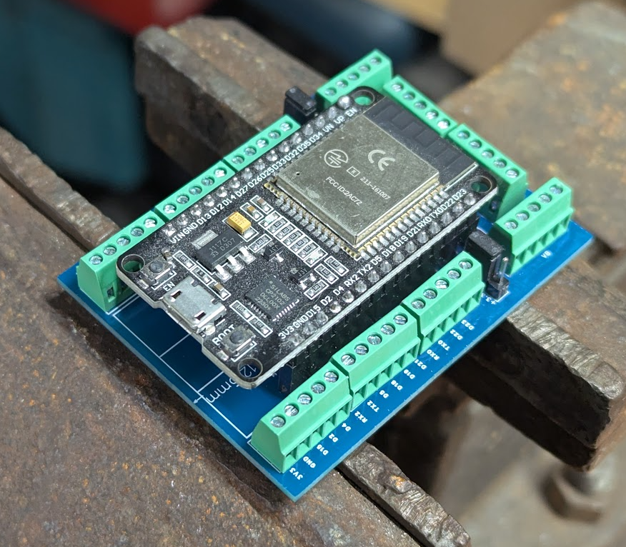

# ESP32 Max Power Breakout

Breakout board for 30pin ESP 32 (1" spacing) with +10 additional power and ground pins.

Every time I have used a screw terminal breakout board I have also needed a bunch of terminals for power and ground. Adding a mechanical switch? You need a ground pin. Adding any random module? You need power and ground. Adding some LEDs? You need power and ground.

So this board will give you an additional 10 power terminals and 10 ground terminals. Even better the power pins are split into two bank (VA and VB) and using the jumpers you can make these 5V or 3.3V depending on your needs. All this in a footprint smaller than most other breakout boards available.

Gerber files ready for [JLC](https://jlcpcb.com/) can be found in the Releases section on the right.

Everything is thru hole, you will need to add the following parts. There are a lot of options for these parts, links provided as a starting point, nothing special about the specific part numbers.

| Part Description                                 | Digikey | Amazon |
|--------------------------------------------------|----------|----------|
| Screw terminals, 0.1" pitch, 5pin, qty 10        | [ED10564-ND](https://www.digikey.com/en/products/detail/on-shore-technology-inc/OSTVN05A150/1588865)         | [30 pack](https://www.amazon.com/Augiimor-30PCS-2-54mm-Terminal-Connector/dp/B08B3LP618)         |
| Male header pins, 0.1" pitch, 3pin, qty 2        | [10129378-936002BLF-ND](https://www.digikey.com/en/products/detail/amphenol-cs-fci/10129378-936002BLF/7915974)         | [assortment](https://www.amazon.com/dp/B0FCTSSLK9)         |
| Female header pins, 0.1" pitch, 15pin, qty 2     | [S7013-ND](https://www.digikey.com/en/products/detail/sullins-connector-solutions/PPTC151LFBN-RC/810153)         | [assortment](https://www.amazon.com/dp/B0FCTSSLK9)         |
| Jumper, 0.1" pitch, qty 2                        | [S9001-ND](https://www.digikey.com/en/products/detail/sullins-connector-solutions/SPC02SYAN/76375)         | [100pcs](https://www.amazon.com/California-JOS-Standard-Circuit-Connection/dp/B0BRK36G33)         |

## Additional Information

[Schematic](media/ESP32_breakout_sch.pdf)

[PCB 3D Model (step)](media/3D_ESP32_Breakout_V2_2026-01-12.step) only PCB and screw terminals

## Images

